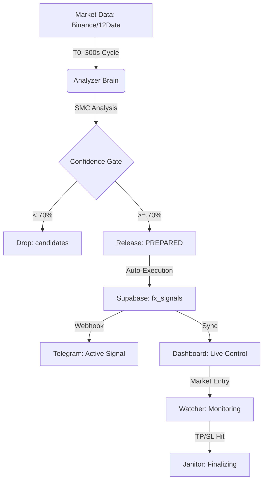

# 🌌 Quantix AI Core - Master Architecture v3.8.6
*The Single Source of Truth for Institutional Intelligence & Execution*

---

## 🏗️ 1. Architecture Philosophy
Quantix is designed as a **Distributed Market Intelligence Engine** operating on the **5W1H Transparency Framework** (Who, What, Where, When, Why, How). 

### Core Pillars:
1.  **Distributed Intelligence**: Micro-services running independently on Railway Cloud.
2.  **Institutional Validation**: Cross-verification of data via Binance & Pepperstone feeds.
3.  **Unified Observability**: Real-time log sniffing (Sniffer-Chain) directly to the database.
4.  **Zeroentry Miss-rate**: Optimization for Market Execution at high-confidence moments.

---

## 🛰️ 2. Distributed Service Map (Railway Ecosystem)

| Service | Script | Role | Observability Key |
| :--- | :--- | :--- | :--- |
| **API Server** | `start_railway_web.py` | Signal broadcast & Client sync | `UVICORN_LOG` |
| **Analyzer** | `start_railway_analyzer.py` | Intelligence Brain (SMC-Lite & Release Gate) | `ANALYZER_LOG` |
| **Watcher** | `start_railway_watcher.py` | Lifecycle monitor (TP/SL/Expiry) | `WATCHER_LOG` |
| **Validator** | `start_railway_validator.py` | Discrepancy & Feed audit | `VALIDATOR_LOG` |
| **Watchdog** | `start_railway_watchdog.py` | Active Healing (Janitor) & System Safety | `WATCHDOG_LOG` |

---

## 📊 3. End-to-End Signal Pipeline

---

## 🧠 4. Strategy & Trading Rules (Institutional v3.8)

### Signal Release Logic:
*   **Confidence Threshold**: **70% (0.70)** (Adjusted for higher signal flow).
*   **Asset**: EURUSD (M15 Primary).
*   **SMC Lite**: BOS (Break of Structure), FVG (Fair Value Gap), Asian Range Liquidity Sweep.

### Dynamic Risk Management (v3.8.6):
Unlike retail systems, Quantix uses **ATR-based Dynamic TP/SL** adjusted by session volatility:
*   **PEAK (London/NY overlap)**: TP ~8-12 pips | SL ~15-20 pips (High RR).
*   **HIGH (London)**: TP ~6-8 pips | SL ~12-18 pips.
*   **LOW (Asia/Late NY)**: TP ~3-4 pips | SL ~8-12 pips (Scalper mode).
*   **Max Pending**: 35 minutes (Entry window).
*   **Max Duration**: 180 minutes (Total trade lifetime).

---

## 🔬 5. Unified Observability (Sniffer-Chain)
Every service launcher wraps the process in a thread-safe Sniffer that pipes all output directly to the `fx_analysis_log` table:
*   **Zero-Blindness**: Monitor all workers remotely without Railway account access.
*   **Active Healing**: Watchdog automatically triggers `Janitor.run_sync()` if any service heartbeat stalls for >15 min.

---

## 📁 6. Repository Ecosystem
The project is split into two specialized repositories:
1.  **`Quantix_AI_Core`**: The "Backend/Brain" containing analysis logic, database wrappers, and service launchers.
2.  **`quantix-live-execution`**: The "Frontend/Terminal" focused on real-time signal display and execution visualization.

---
**Version**: 3.8.6 | **API Domain**: `quantixapiserver-production.up.railway.app`  
*Document verified 2026-03-05 by Antigravity AI.*
